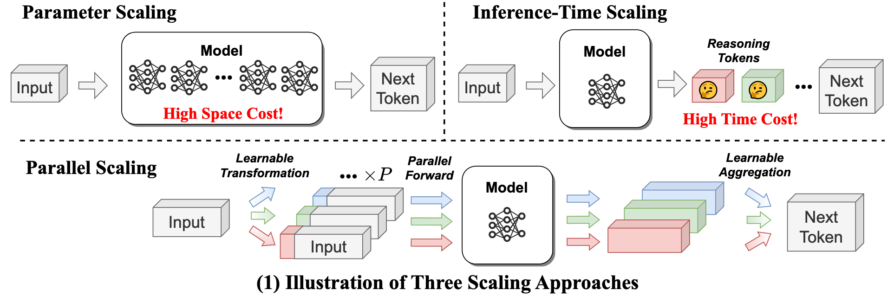
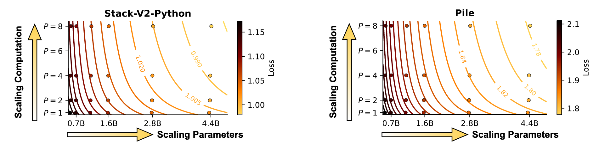

# Paper review: Parallel Scaling Laws for Language Models

> Also see here: [May Graphcore Papers of the Month](https://graphcore-research.github.io/papers-of-the-month/parallel-scaling-evolving-code-understanding-llm-reasoning/#parallel-scaling-laws-for-language-models)

### The key idea

Researches at Qwen introduce a new dimension of scaling: parallel forward passes. Their method, PARSCALE, runs $P$ parallel copies of a model, each with a different learned prefix. They find that running $P$ parallel passes is equivalent to scaling the model parameters by $O(\log P)$.

> Three parallel scaling approaches: Parameter, Inference time, and Parallel computation.

### Background

The approach comes from a practical inference bottleneck: for large models, single batch inference can be memory-bound, especially on resource constrained edge devices. Rather than increasing model size or generating more reasoning steps, PARSCALE aims to scale a new axis, parallel computation, to keep model size approximately constant while improving performance.

Inspired by techniques like Classifier-Free Guidance (CFG), PARSCALE hypothesizes:

> Scaling parallel computation (while maintaining the nearly constant parameters) enhances the model’s capability, with similar effects as scaling parameters.

### Methodology

PARSCALE executes $P$ forward passes in parallel, each conditioned with a unique learned prefix (implemented via prefix tuning). Outputs of the different streams are combined using a learned aggregation MLP.

Unlike inference-time tricks (e.g., beam search or self-consistency), PARSCALE learns the aggregation during _training_, leading to more effective use of parallel compute. Conceptually this is similar to ensembling, but with almost complete parameter sharing between the members.

#### Training Strategy

To reduce training costs, they propose a two-stage approach:

- Stage 1: Standard pre-training (1T tokens)
- Stage 2: Add PARSCALE (20B tokens, 2% overhead)

Dramatically reduces cost of parallel scaling training (which requires $P$ forward passes) only applied to the final 20B tokens, not the full 1T.

### Results

> PARSCALE results: Parameter, Inference time, and Parallel computation.

#### Coding Tasks (Stack-V2-Python)

| Model Params | P  | HumanEval+ (%) |
|--------------|----|----------------|
| 1.6B         | 1  | 33.9           |
| 1.6B         | 8  | 39.1           |
| 4.4B         | 1  | 39.2           |

#### General Tasks (Pile)

| Model Params | P  | Avg Score (%) |
|--------------|----|---------------|
| 1.6B         | 1  | 53.1          |
| 1.6B         | 8  | 55.7          |
| 2.8B         | 1  | 55.2          |

For a 1.6B model, scaling to $P=8$ parallel streams achieves performance comparable with a 4.4B model on coding tasks. These efficiency gains are most pronounced at small batch sizes ($\leq 8$) where inference is memory-bound. This makes PARSCALE most suitable for edge deployment scenarios.

- 22x less memory increase compared to parameter scaling.
- 6x lower latency.
- 8x increase (linear with $P$) KV cache size.

#### Dynamic Parallel Scaling

PARSCALE remains effective with frozen main parameters for different values of P. This enables dynamic parallel scaling: switching P to dynamically adapt model capabilities during inference.

### Takeaways

PARSCALE provides a new axis in which to boost model capability, particuarly in resource constrained single-batch inference. However KV cache grows linearly with the number of parallel streams ($P$) so effectiveness may diminish beyond $P=8$ (the largest tested configuration). It is an open question as to whether $O(\log P)$ scaling holds for $P ≫ 8$.
