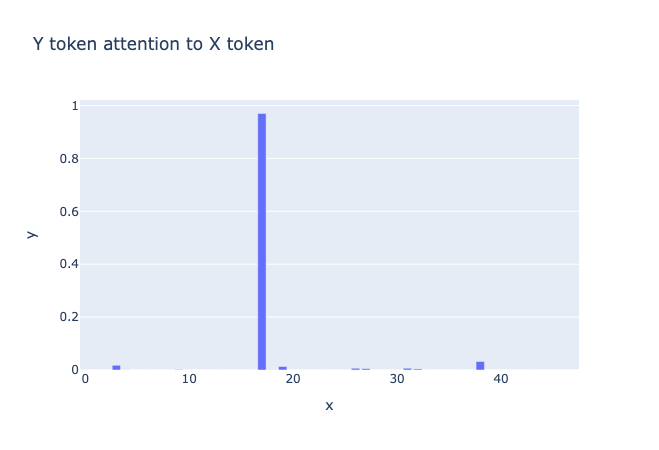

# Interpreting a Trigram Model -- A Worklog

This is my working log attempting to solve the [November Mechanistic Interpretability challenge](https://arena3-chapter1-transformer-interp.streamlit.app/~/+/Monthly_Algorithmic_Problems#trigrams-november-2024).

The problem outlines a model that has been trained on a dataset of 95% random tokens, with 5% of the tokens being a trigram. Throughout this log I will use the notation `(X, Y, Z)` to refer to the three tokens in any given trigram.

The model essentially learns:

For a given token `Y`, if the previous token is `X` then the next token is `Z` for a given set of `(X, Y, Z)`. This allows the model to score extremely highly on the `Y` token of any given learned trigram (correctly predicting `Z`).

This is showcased in the question with the plot:


______________________________________________________________________

That's all setup, real work starts from here.

## Model Architecture

> The model is a simple 1 layer transformer with a single attention head and no final layer norm.

```
n_layers: 1

d_vocab: 75
seq_len: 50

d_model: 32

n_heads: 1
d_head: 16

d_mlp: 20
```

### Layer Norm

No layer norm at the end, is there one at the start?

Can this be folded as a linear xfm and into the QKV weights?

### Attn only vs MLP

Why do we need a MLP layer at all? can't this problem be solved with a single attn head?

To test this, modified trained a model with no MLP layer, and . It seems to perform well:

#### Attn only

```
metrics/train_loss	4.17597
metrics/train_loss_as_frac	0.34443
metrics/trigram_avg_correct_prob	0.71363
metrics/trigram_frac_correct	0.90614
metrics/trigram_n_correct	251
```

#### (Original) Attn & MLP

```
metrics/train_loss	4.15741
metrics/train_loss_as_frac	0.25847
metrics/trigram_avg_correct_prob	0.80103
metrics/trigram_frac_correct	0.9639
metrics/trigram_n_correct	267
```

#### 

There doesn't seem to be a meaningful difference between the performance of the models, especially considering that the attn & mlp model has significantly more parameters.

It seems to be that it's not required for the circuit. The question now for the MLP now is, what work is it doing? Perhaps recovering attn projection from superposition so it can pack more trigrams in an attn head?

## Attention Graphs

Ok great, lets look at the attention graphs to see what's going on in there.


You can see at sequence position 18 the model attends to the token before it. This lines up with the `Y` token of the trigram! Let's see if this is always the case:

```python
pattern = cache["pattern", 0, "attn"][:, 0, :, :]  # [batch, [first head], seq_q, seq_k]
x = t.arange(pattern.shape[1])
y = t.clamp(t.arange(pattern.shape[2]) - 1, min=0)
prev_attn = pattern[:, x, y][:, 1:-1] # cut bos and eos token as special cases.
line(prev_attn[0], title="Y token attention to X token")
```



This snippet gets the previous attention score of the previous token. I cut the first token because it does not have a previous token so always may only attend to itself, and will never qualify for a `Y` token.

I also found the final token to very highly attend to the second to last token some of the time.

However the final token can never be part of a full trigram so these will be excluded aswell.

Q: does it attend when a natural trigram occurs? or because of the training process? Investigate in more detail.

So without getting too sidetracked I think the final token attends to the previous quite often, and I think this might be a quirk of the training process? Perhaps the model always has `seq_len = 50` so 49 is never in the trigram therefore the positional embedding for it is not properly trained?

The positional embedding is initialized as a random parameter (not fixed sinusodial or rope or anything) so probably won't have feature geometry of _rotation_ so the circuit is not of the generalized rotation form.

It is strange that it often attends to the previous one though, rather than defaulting to its own token. What does this say about the training process?

However I'm getting sidetracked and jumping to conclusions. Anyway...

---

Given the previous attention scores, if we filter for those above 0.2 probability, it gives the _exact_ set of trigrams that the model predicted.

Notably, it does not include trigrams the model didn't predict, it seems that attending highly to the previous token is (perfectly causal?) to being in an anagram and correctly predicting the `Z` token.

This gives more weight to my architecture argument from before, that the MLP is not a critical component of the circuit.

```python
trigram_preds = t.argwhere(probs_correct > 0.2) # Correctly predicting logits (Z token)

attn_Y = t.argwhere(prev_attn > 0.2) # Y token predicted from attn scores
attn_Z = t.stack([attn_Y[:, 0], attn_Y[:, 1] + 1], dim=0).T # Z = Y + 1

(
  set(tuple(idx) for idx in trigram_preds.tolist())
  == set(tuple(idx) for idx in attn_Z.tolist())
)
>>> True
```

Now lets find the QK circuit that causes Y to attend highly to X.

## Finding QK

So my current hypothesis is that the QK circuit is soley responsible for identifying the current token Y as a trigram.

So the question is how? we basically have the form

```python
# Embedding
resid = W_E[toks] + W_P
resid = norm(resid) * scale + bias # layer norm

# Attn
q = Q(resid)
k = K(resid)

scores = causal_mask(q @ k * d_scale)
pattern = softmax(scores)
```

So for now can we ignore the layer norm, not entirely sure how to deal with that. There's some tutorials on it but I think it can factored out by folding into the QK matrices and stuff.

### Hypothesis

> Don't jump to conclusions!

It seems to me that since there is a fixed set of trigrams, the Q and K vectors can be specialized for the `W_E` and `W_P`. I think something like:

`Q( W_E(Y) ) @ K( W_E(X) )` => high similarity if a learned trigram

This would not be sufficient by itself, 


`Q( W_P(Y) ) @ K( W_P(Y) )` =>  

`Q(W_P) @ K(W_P)`

 the `W_E` matrix may put X and Y trigram tokens nearish in embedding space, and 

the `K(W_P)` from the X token maps to the Y token or vice versa, `Q(W_P)` of the X token maps to the Y token W_E.

Or could it be the other way? W_P is the base and `Q(W_E) @ K(W_E)` maps to a shared space? no I don't think so because we would have to do a xfm because the base W_P is different.

I don't _think_ the base could be W_P and the W_E maps the token, because the 

